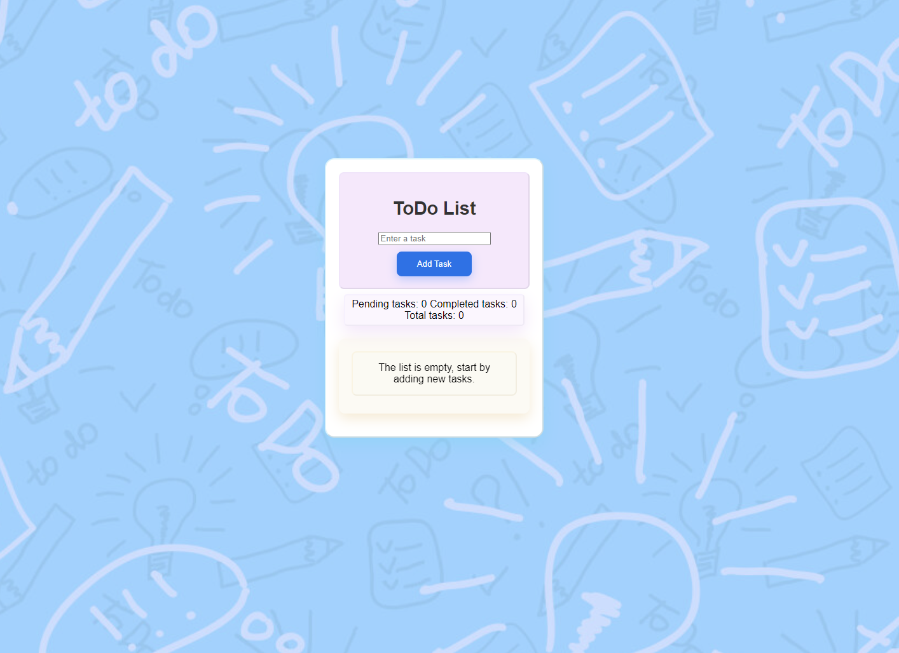

# introWebExercise4 -Todo List
This is a ToDo application, built as a requirement to pass exercise 4 in introductopn to webbdevelopement at Lernia yrkesHögskola. its a  web application built using JavaScript, HTML, and SCSS. The application allows users to manage and track their tasks with functionality to add, complete, and delete tasks. Task data is stored in the browser's `localStorage`, so tasks persist even after refreshing the page.

## Features

- Add new tasks to the list.
- Mark tasks as completed.
- Delete tasks from the list.
- Real-time task counters for total, pending, and completed tasks.
- Data persistence using `localStorage`.
- Basic form validation with error handling for empty task input.

## Technologies Used

- **HTML**: Structure of the application.
- **SCSS**: Styling of the UI.
- **JavaScript**: Interactivity, task management, and data persistence.
- **Vite**: Development server and build tool.
- **LocalStorage**: Used to store tasks locally in the browser.

## Getting Started

### Prerequisites

Ensure you have the following installed:

- **Node.js** (version 14 or higher)
- **Vite** (installed through npm)

# To start the project:
npm run dev

# Author:
[Elena Lehto Fredenbrink]
